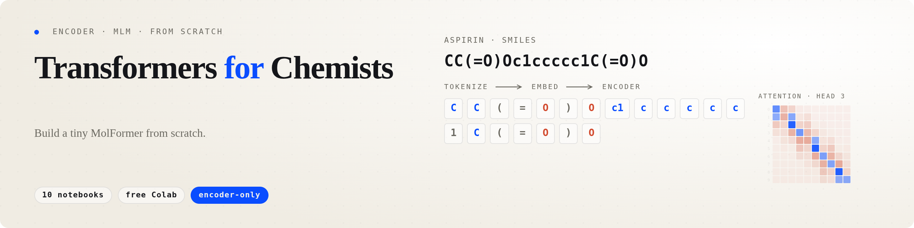

<p align="center">
  
</p>

# Transformers For Chemists

Implementations of transformer models from scratch for chemists — building toward a small **MolFormer-style, encoder-only, MLM-pretrained** model that fits on a free Google Colab.

## Project Description

This repository is a sister course to [GNNs-For-Chemists](https://github.com/HFooladi/GNNs-For-Chemists). Where the GNN course teaches molecules as graphs, this one teaches molecules as **sequences** — SMILES strings tokenized and fed through a transformer encoder. Each notebook builds the next layer of the stack from scratch, with chemistry-first intuition and rich visualizations, so that by the end you can pre-train and fine-tune your own tiny chemical foundation model.

The course focuses on **encoder-only / bidirectional** transformers (BERT-style, MolFormer-style), since these are the workhorses of property prediction and representation learning in chemistry. Causal/decoder transformers (GPT-style) are mentioned for context but not the focus.

## Prerequisites

To get the most out of this tutorial series, you should have:

- **Python**: Basic to intermediate Python programming skills
- **Chemistry**: Fundamental understanding of molecular structures and SMILES notation
- **Machine Learning**: Basic familiarity with neural networks and gradient descent
- **Mathematics**: Basic linear algebra (matrix multiplication, dot products)
- **Packages**: Familiarity with PyTorch, NumPy, and RDKit (installation instructions provided in notebooks)

No prior experience with transformers or attention is required — we build the concepts from the ground up!

## Resources

### Core Tutorial Sequence

The following notebooks (01, 02, 03, ...) form the **main learning path** and are essential for understanding transformer fundamentals applied to chemistry:

| Notebook | Description | Open in Colab | Year |
| -------- | ----------- | -------------- | ---- |
| 01_From_SMILES_to_Tokens.ipynb | SMILES as sequence; character-level tokenization | [](https://colab.research.google.com/github/HFooladi/Transformers-For-Chemists/blob/main/notebooks/01_From_SMILES_to_Tokens.ipynb) | 2026 |
| 02_Subword_Tokenization.ipynb | BPE and SMILES-pair encoding for molecules | [](https://colab.research.google.com/github/HFooladi/Transformers-For-Chemists/blob/main/notebooks/02_Subword_Tokenization.ipynb) | 2026 |
| 03_Embeddings_and_Positions.ipynb | Token embeddings and positional encodings | [](https://colab.research.google.com/github/HFooladi/Transformers-For-Chemists/blob/main/notebooks/03_Embeddings_and_Positions.ipynb) | 2026 |
| 04_Self_Attention_From_Scratch.ipynb | Q/K/V intuition and scaled dot-product attention | [](https://colab.research.google.com/github/HFooladi/Transformers-For-Chemists/blob/main/notebooks/04_Self_Attention_From_Scratch.ipynb) | 2026 |
| 05_Multi_Head_Attention.ipynb | Multiple heads and head specialization | _coming soon_ | 2026 |
| 06_The_Transformer_Block.ipynb | Attention + FFN + LayerNorm + residuals | _coming soon_ | 2026 |
| 07_Training_a_Property_Predictor.ipynb | Single-block transformer trained supervised | _coming soon_ | 2026 |
| 08_Masked_Language_Modeling.ipynb | MLM objective and masked SMILES training | _coming soon_ | 2026 |
| 09_Tiny_MolFormer.ipynb | End-to-end pre-training and fine-tuning | _coming soon_ | 2026 |
| 10_HuggingFace_Reimplementation.ipynb | The same model via `transformers` and `tokenizers` | _coming soon_ | 2026 |

### Supplementary Deep-Dive Notebooks

These notebooks (02.1, 04.1, ...) provide **additional details and advanced topics** that complement the main series:

| Notebook | Description | Open in Colab | Year |
| -------- | ----------- | -------------- | ---- |
| 02_1_Tokenization_Effect.ipynb | How tokenizer choice changes downstream performance | [](https://colab.research.google.com/github/HFooladi/Transformers-For-Chemists/blob/main/notebooks/02_1_Tokenization_Effect.ipynb) | 2026 |
| 04_1_Linear_Attention.ipynb | O(N) attention (the MolFormer choice) | _coming soon_ | 2026 |
| 04_2_Rotary_Position_Embeddings.ipynb | RoPE intuition and implementation | _coming soon_ | 2026 |
| 04_3_Other_Position_Encodings.ipynb | ALiBi and relative-position encodings | _coming soon_ | 2026 |
| 08_1_Masking_Ratio_Study.ipynb | Empirical sweep of MLM masking ratios | _coming soon_ | 2026 |
| 09_1_GNN_vs_Transformer.ipynb | Head-to-head comparison on MoleculeNet tasks | _coming soon_ | 2026 |

## Contributing

Contributions are welcome! Please see [CONTRIBUTORS.md](CONTRIBUTORS.md) for guidelines on how to contribute.

## License

This project is licensed under the MIT License — see the [LICENSE](LICENSE) file for details.

## Citation

If you use this repository in your research or teaching, please cite it as:

```bibtex
@misc{transformers_for_chemists,
  author = {Fooladi, Hosein},
  title = {Transformers For Chemists: Building a Tiny MolFormer from Scratch},
  year = {2026},
  publisher = {GitHub},
  journal = {GitHub repository},
  howpublished = {\url{https://github.com/HFooladi/Transformers-For-Chemists}},
  note = {Educational resource for chemists, pharmacists, and researchers building encoder-only transformer models for chemical applications}
}
```
